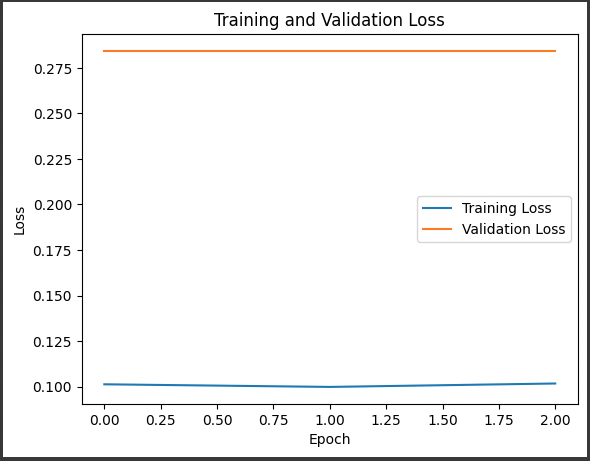

# CS 521 - Statistical natural language Processing : Final Semester Project (Spring 2024)

# Paraphrase-Detection using Transformer architecture based language model. 
# by - Prajwal Athreya Jagadish and Kavya Rama Nandana Sidda (images to be added here after description)

## Introduction
## Environment setup
## Dataset used
## Custom dataset class
## Tokenization
## Dataloader for sequence classification
## Training Loop
## Evaluation on Validation dataset
## Evaluation on Test dataset
## Saving the model by giving a path
## Model for inference

## Fine-tuned model and example cases

## Analytics and Evaluation

### Output:

 
## Conclusion
