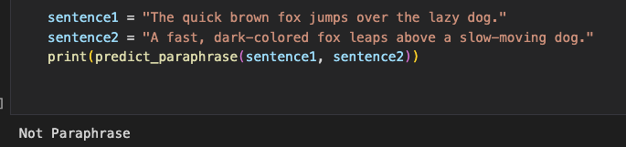
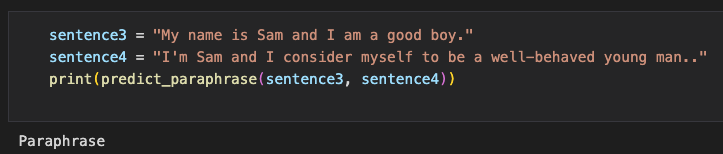
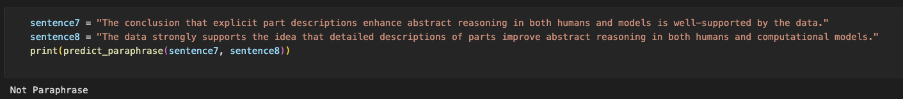
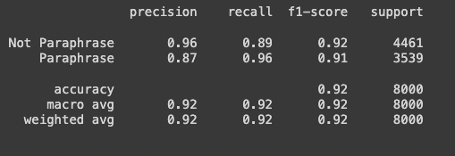

# CS 521 - Statistical natural language Processing : Final Semester Project (Spring 2024)
Paraphrase-Detection using Transformer architecture based language model.
Authors : Prajwal Athreya Jagadish and Kavya Rama Nandana Sidda

## Introduction

Accurate paraphrasing identification is crucial for Natural Language Processing (NLP) applications, which include machine translation, question-answering systems, and plagiarism detection. Finding paraphrases or writings with the same content but conveyed differently may be difficult since human language is complex and varied. NLP's traditional models have frequently failed to capture the subtleties and complexity of paraphrase detection. Taking note of these difficulties, this study aims to apply the state-of-the-art NLP model Bidirectional Encoder Representations from Transformers (BERT) to improve the effectiveness of paraphrase identification. The design of BERT offers a strong foundation for comprehending the contextual relationships found in the text since it uses deep learning techniques to analyze words in relation to every other word in a sentence (as opposed to one-directional reading). We aim to investigate how BERT's detection performance of paraphrases might be enhanced by fine-tuning it on a carefully selected dataset with various paraphrase variants. We want to raise the bar for paraphrase detection accuracy by combining BERT's sophisticated features with a focused training strategy, opening the door to more dependable applications across various NLP areas.

## Environment setup

We set up our development environment to ensure all the libraries and dependencies were installed. This incorporated PyTorch for deep learning, implementing the BERT model, which included the Transformers library, and other necessary libraries, such as Scikit-learn and Pandas.

## Dataset used

We used the Paraphrase Adversaries from Word Scrambling (PAWS) dataset for this study, as detailed in the arXiv:1904.01130 publication. A thorough environment for assessing our optimized BERT model, PAWS is painstakingly created to evaluate the resilience of paraphrase detection techniques against intricate sentence structures and situations. The sentences in the sample are paired off and assessed for paraphrase. If two sentences are paraphrases of one another, they are labeled as "Paraphrased"; if not, they are labeled as "Not paraphrased." With 100,000 sentence pairings in the PAWS dataset, a wealth of information is available for training and validation.
 

## Custom dataset class

The dataset used for paraphrase identification is managed by a specific dataset class that we designed.Preprocessing and data loading were made simpler by the interface this class provided to access individual samples.

## Tokenization

⁤We generated a tokenizer for the dataset using the BERT tokenizer provided by the Transformers library. ⁤⁤Tokenization is a critical step in getting the textual data ready for the model.

## Dataloader for sequence classification

⁤To precisely address sequence classification challenges, we developed a DataLoader. To get the data ready for model training, our DataLoader took care of batching, rearranging, and padding of sequences.

## Training Loop

We devised and implemented the training loop. It comprised mini-batches of dataset iterations, forward and backward model passes, and parameter updates using learning rate scheduling and AdamW optimization approaches.

## Evaluation on Validation dataset

Throughout the training phase, the model was tested on a held-out validation dataset on a regular basis. This assisted in keeping an eye on the model's functionality and preventing overfitting. We could modify the hyperparameters and improve the training process more intelligently by using the metrics previously given. For instance, we may think about techniques to lower false positives, such changing the classification threshold or increasing regularization, if we saw that the precision was especially poor.

## Evaluation on Test dataset

An independent test dataset was used to assess the final model after validation findings indicated that the training was adequate. This dataset gave an objective assessment of the model's performance in real-world scenarios because it was not viewed by the model during training.
Carefully documented were the accuracy and F1 score on the test dataset.To assess the model's generalizability to fresh data and show the performance, the confusion matrix was plotted.

## Saving the model by giving a path

We stored the model and tokenizer to disk for later usage and deployment after the model had been trained and assessed. This made it possible to utilize the trained model for inference with ease and eliminated the requirement for retraining.

## Model for inference

To show that the stored model can recognize paraphrases, we used it to do inference on a collection of sample texts. against assessing the accuracy of the model, the predictions were compared against ground truth labels.

## Fine-tuned model and example cases
Following are some example:

## Analytics and Evaluation
Following are some of the metrics and analysis for our fine-tuned bert model:

 The above graph shows Average Attention Weights for Token 0, indicating the importance of a specific token across different layers in a neural network, with attention weight values ranging across layers and higher values suggesting greater relevance.

 The above image shows a Confusion Matrix for a classification model distinguishing between paraphrases and non-paraphrases, with the matrix indicating high numbers of true positives and true negatives, implying good performance, though there are some misclassifications evident in the off-diagonal cells.

 Above is the graph of "Training and Validation Loss" across epochs, depicting a typical convergence pattern where both training and validation loss decrease over time, suggesting that the model is learning and generalizing well to unseen data as epochs progress.

 The above image contains a classification report in table format, showing high precision, recall, and F1-scores for both classes ('Not Paraphrase' and 'Paraphrase'), along with overall metrics such as accuracy and macro-averaged scores, all indicating a high-performing model with a total support of 8,000 instances.

 
## Conclusion

In conclusion, we were able to effectively use the BERT-base-uncased model to paraphrase detection in our project work. We created a reliable method for determining sentence similarity by employing a methodical approach that included data preparation, model training, assessment, and inference. By using the trained model in applications that need paraphrase detection, it may be improved even further and help progress the field of natural language comprehension.
